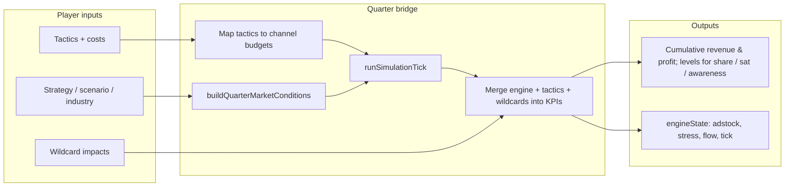

# CMO Simulator: Engine & Outcome Logic (Implementation Reference)

This document describes **how outcomes are computed in the repository today**: code paths, variables, formulas, and design intent. It is intended for product, engineering, and (eventually) end users who want a transparent breakdown of the simulation.

**Scope:** Runtime behavior in `src/engine`, `src/lib/simMachine.ts`, `src/lib/marketConditions.ts`, `src/lib/simulationForecast.ts`, and related modules. Aspirational mechanics described in [`docs/design/SIMULATION_DESIGN_SPEC.md`](design/SIMULATION_DESIGN_SPEC.md) are noted where they diverge from code.

**Maintenance:** When you change formulas or constants, update this file and reference the source files listed in each section.

---

## Table of contents

1. [Conceptual architecture](#1-conceptual-architecture)
2. [Runtime paths (two entry points)](#2-runtime-paths-two-entry-points)
3. [Core data shapes](#3-core-data-shapes)
4. [State machine: quarters and events](#4-state-machine-quarters-and-events)
5. [Quarter resolution: `processQuarterAdvance`](#5-quarter-resolution-processquarteradvance)
6. [Market conditions: `buildQuarterMarketConditions`](#6-market-conditions-buildquartermarketconditions)
7. [Engine tick: `runSimulationTick`](#7-engine-tick-runsimulationtick)
8. [Bridging engine output to player KPIs](#8-bridging-engine-output-to-player-kpis)
9. [Forecasting and scenario bands](#9-forecasting-and-scenario-bands)
10. [Wildcards, big bets, and morale](#10-wildcards-big-bets-and-morale)
11. [Final score, grades, and recommendations](#11-final-score-grades-and-recommendations)
12. [Supplementary modules (not on the main quarter path)](#12-supplementary-modules-not-on-the-main-quarter-path)
13. [Scenario presets (setup) vs engine defaults](#13-scenario-presets-setup-vs-engine-defaults)
14. [Glossary](#14-glossary)
15. [Known gaps and modeling caveats](#15-known-gaps-and-modeling-caveats)

---

## 1. Conceptual architecture

The simulation separates three layers:

| Layer | Responsibility | Primary files |
|--------|----------------|----------------|
| **Game orchestration** | Quarters, tactics, budget, wildcards, persistence UX | `SimulationProvider.tsx`, `simMachine.ts`, `useSimulation.ts` |
| **Marketing physics engine** | Carryover spend (adstock), diminishing returns (Hill), channel mix (synergy), traffic → revenue | `src/engine/index.ts`, `adstock/`, `saturation/`, `synergy/` |
| **Presentation & pedagogy** | Forecast UI, debrief copy, tactic profiles | `simulationForecast.ts`, UI components |

Rough data flow when a quarter completes:



---

## 2. Runtime paths (two entry points)

### 2.1 Main product path (recommended mental model)

- React context wraps an **XState** machine: `simulationMachine` in `src/lib/simMachine.ts`.
- Completing **Q1–Q4** runs **`processQuarterAdvance`**, which calls **`runSimulationTick`** once per completed quarter.
- Player tactics are **not** passed as raw channel sliders here; they are **mapped** into eight engine channels (see §5.1).

### 2.2 Demo / lab path

- `src/lib/store.ts` exposes `advanceTick(playerInputs, marketConditions)` which calls the same **`runSimulationTick`**.
- `src/app/engine-demo/page.tsx` uses **`useGameStore`** for interactive channel budgets.

Both paths share identical tick mathematics.

---

## 3. Core data shapes

### 3.1 Engine types (`src/types/engine.ts`)

- **`Channel`**: `'tv' | 'radio' | 'print' | 'digital' | 'social' | 'seo' | 'events' | 'pr'`.
- **`PlayerInput`**: `channelBudgets: Record<Channel, number>`, `promotions` (structure exists; main quarter path passes empty promotions from `processQuarterAdvance`).
- **`MarketConditions`**:
  - **`seasonalityIndex`**: multiplier on demand (combined scenario + industry + quarter).
  - **`economicIndex`**: multiplier on traffic efficiency (clamped inside the tick).
  - **`competitorSpend`**: per-channel competitor spend table (used for forecasting exposure and scenario patching; **not** read inside `runSimulationTick` for revenue—see §15).
- **`SimulationState`**: tick counter, industry, market conditions, **adstock** carryover, **results** (sales funnel outputs), optional stress meters, brand position, trust multiplier, flow state.

### 3.2 Game context (`SimulationContext` in `simMachine.ts`)

- **`strategy`**: company setup, **industry**, **marketLandscape**, channels, etc.
- **`quarters.Q1…Q4`**: tactics, wildcards, optional big bet (Q3), quarter **results** snapshot.
- **`kpis`**: cumulative **revenue**, **profit**; absolute **marketShare**, **customerSatisfaction**, **brandAwareness** (each typically 0–100 where applicable).
- **`totalBudget` / `remainingBudget`**: enforced when adding tactics or wildcard choices.
- **`engineState`**: full **`SimulationState`** after each quarter tick.
- **`morale`**, **`brandEquity`**: updated by wildcard impacts; not part of the numeric **final score** formula (§11).

### 3.3 Tactics (`Tactic`)

- **`category`**: `'digital' | 'traditional' | 'content' | 'events' | 'partnerships'`.
- **`cost`**: dollars; deducted from **`remainingBudget`** when added.
- **`expectedImpact`**: `{ revenue, marketShare, customerSatisfaction, brandAwareness }`.

**Important:** **`expectedImpact.revenue` does not flow into quarter revenue** in `processQuarterAdvance`. Quarter revenue from marketing activity comes from the engine’s **`incrementalSales`** (derived from spend). The **`revenue`** field on tactics is legacy or UI-only unless wired elsewhere.

---

## 4. State machine: quarters and events

The machine (`simMachine.ts`) sequences:

`idle` → `strategySession` → `Q1` → `Q2` → `Q3` → `Q4` → `debrief` → `completed`.

Relevant events include:

- **`SET_STRATEGY`**, **`COMPLETE_STRATEGY_SESSION`** (requires audience, positioning, primary channels).
- **`ADD_TACTIC` / `REMOVE_TACTIC`**: updates quarter tactic list and budget.
- **`TRIGGER_WILDCARD`**, **`RESPOND_TO_WILDCARD`**, **`APPLY_WILDCARD_IMPACT`**.
- **`MAKE_BIG_BET`** (Q3 only): applies randomized outcome to KPIs and records `bigBetMade`.
- **`COMPLETE_QUARTER`**: runs **`processQuarterAdvance`** for that quarter and advances state.

Hydration merges saved runs via `mergeSimulationContext` (`simulationHydration.ts`).

---

## 5. Quarter resolution: `processQuarterAdvance`

**Source:** `processQuarterAdvance` in `src/lib/simMachine.ts`.

This function is the **single authoritative bridge** from “what the player planned this quarter” to “new `engineState` + new KPIs.”

### 5.1 Tactic → channel budgets

Each tactic’s **`cost`** is allocated **evenly** across channels determined by **`categoryToChannelMap`**:

| Tactic category | Engine channels receiving equal splits |
|-----------------|----------------------------------------|
| digital | digital, social, seo |
| content | seo, pr, digital |
| traditional | tv, radio, print |
| events | events, pr |
| partnerships | pr, digital |

Formula for one tactic:

\[
\text{amountPerChannel} = \frac{\text{tactic.cost}}{\left|\text{mappedChannels}\right|}
\]

Unknown categories default to **`['digital']`**.

**`totalSpend`** = sum of tactic costs (used for profit).

### 5.2 Player input to the engine

```ts
playerInputs = {
  channelBudgets, // built above
  promotions: [] // quarter advance does not pass promotions today
};
```

### 5.3 Market conditions for this quarter

`buildQuarterMarketConditions({ scenarioId, quarter, industry, marketLandscape, previous: oldEngineState.marketConditions })`

See §6.

### 5.4 Run tick

`runSimulationTick({ ...oldEngineState, industry: strategy.industry ?? oldEngineState.industry }, playerInputs, marketConditions)`

See §7.

### 5.5 Aggregate wildcard deltas

For each `wildcard` in `quarter.wildcardEvents` with `wildcard.impact` set:

- Sum **`revenue`**, **`profit`**, **`marketShare`**, **`customerSatisfaction`**, **`brandAwareness`** (missing treated as 0).

Wildcards without **`impact`** contribute 0 here until **`APPLY_WILDCARD_IMPACT`** stores structured impacts on the event.

### 5.6 Aggregate tactic “soft KPI” deltas

Sum over tactics:

- **`tacticAwarenessImpact`** += `expectedImpact.brandAwareness`
- **`tacticSatisfactionImpact`** += `expectedImpact.customerSatisfaction`
- **`tacticMarketShareImpact`** += `expectedImpact.marketShare`

These feed §8—not engine revenue.

---

## 6. Market conditions: `buildQuarterMarketConditions`

**Source:** `src/lib/marketConditions.ts`.

Produces **`MarketConditions`** deterministically from:

1. **Scenario tuning** (if `scenarioId` is `turnaround`, `hyper-growth`, or `challenger`): overrides baseline **`economicIndex`**, **`baseCompetitorSpend`**, and **`seasonalityByQuarter`**.
2. **Default competitor spend** if no scenario/previous: `DEFAULT_COMPETITOR_SPEND` per channel.
3. **Default quarter seasonality** if not overridden: Q1 0.95, Q2 1.0, Q3 1.0, Q4 1.1.
4. **Industry nudges** (`seasonalityFromIndustry`): e.g. ecommerce/fashion Q4 ×1.15; travel Q2/Q3 ×1.15; education Q3 ×1.2 (multiplied onto scenario seasonality).

Then **market landscape** adjusts economic pressure and competitive tables:

- **`disruptor`**: `economicIndex × 0.9`
- **`frontier`**: `economicIndex × 1.05`
- **`crowded`**: **scale entire competitor spend table × 1.5**

Final **`seasonalityIndex`**:

\[
\text{seasonalityIndex} = \text{scenarioSeasonality}(\text{quarter}) \times \text{industrySeasonality}(\text{industry}, \text{quarter})
\]

**Why:** Separates “macro/seasonal demand” from “traffic efficiency” (**economicIndex**) and stores competitor intensity for **forecast exposure** and scenario preview—even though the base tick ignores **`competitorSpend`** for revenue (§15).

---

## 7. Engine tick: `runSimulationTick`

**Source:** `src/engine/index.ts`  
**Helpers:** `src/engine/adstock/calculateAdstock.ts`, `src/engine/saturation/applyHillTransform.ts`, `src/engine/synergy/calculateSynergy.ts`, `src/lib/utils/calculationHelpers.ts`

The tick is a **pure function**: `(previousState, playerInputs, marketConditions) → newState`.

### 7.1 Step A — Geometric adstock (carryover)

For each channel \(c\):

\[
A_{t}^{(c)} = \text{Spend}_{t}^{(c)} + \lambda^{(c)} \cdot A_{t-1}^{(c)}
\]

| Channel | Decay \(\lambda\) (`DECAY_RATES`) |
|---------|-----------------------------------|
| tv | 0.8 |
| radio | 0.6 |
| print | 0.7 |
| digital | 0.5 |
| social | 0.4 |
| seo | 0.9 |
| events | 0.7 |
| pr | 0.8 |

**Why:** Models lingering effects of media—recent quarters contribute plus decayed history.

### 7.2 Step B — Hill saturation (diminishing returns)

For each channel, response \(R^{(c)} \in [0,1]\):

\[
R^{(c)} = \frac{\left(A^{(c)}\right)^{n^{(c)}}}{\left(S^{(c)}\right)^{n^{(c)}} + \left(A^{(c)}\right)^{n^{(c)}}}
\]

| Channel | Half-saturation \(S\) (`SATURATION_POINTS`) | Shape \(n\) (`SHAPES`) |
|---------|---------------------------------------------|-------------------------|
| tv | 200000 | 2 |
| radio | 100000 | 1.5 |
| print | 80000 | 2.5 |
| digital | 150000 | 1.8 |
| social | 120000 | 1.6 |
| seo | 100000 | 3 |
| events | 50000 | 2 |
| pr | 60000 | 2.2 |

**Why:** Extra dollars eventually add less incremental “response”; SEO uses a higher shape (sharper knee).

### 7.3 Step C — Synergy (channel mix)

Let **`activeChannels`** = channels with **current spend** \(> 0\).

For channel \(i\):

\[
\text{synergyMul}_i = \prod_{j \in \text{active},\, j \neq i} M_{i,j}
\]

where \(M\) is **`SYNERGY_MATRIX`** (see `src/engine/synergy/calculateSynergy.ts`). Diagonal entries are 1; off-diagonals are typically \(\geq 1\) for complementary pairs (e.g. tv–digital 1.2).

Adjusted response:

\[
\tilde{R}_i = R_i \times \text{synergyMul}_i
\]

**Why:** Rewards coherent mixes; **multiplicative** stacking means many active channels can raise responses sharply (§15).

### 7.4 Step D — Traffic by channel

Let \(\text{EI} = \mathrm{clamp}(\text{economicIndex}, 0.1, 2.0)\).

For each channel:

\[
\text{traffic}_i = \tilde{R}_i \times \text{spend}_i \times \eta_i \times \text{EI}
\]

where \(\eta_i\) is **`TRAFFIC_EFFICIENCY`**:

| Channel | \(\eta\) |
|---------|----------|
| tv | 0.02 |
| radio | 0.015 |
| print | 0.01 |
| digital | 0.05 |
| social | 0.03 |
| seo | 0.08 |
| events | 0.04 |
| pr | 0.025 |

**Why:** Converts “effective response × dollars” into a synthetic traffic volume scaled by macro efficiency.

### 7.5 Step E — Funnel: leads and conversions

Constants in code:

- **`leadRate`** = 0.05 → 5% of total traffic becomes leads.
- **`baseConversionRate`** = 0.15 → 15% of leads convert.

\[
\text{leads} = \lfloor \text{totalTraffic} \times 0.05 \rfloor,\quad
\text{conversions} = \lfloor \text{leads} \times 0.15 \rfloor
\]

**Why:** Simple funnel; exposes nonlinear effects of traffic changes due to floors.

### 7.6 Step F — Industry value and base revenue

**Industry table** `INDUSTRY_DATA[industry]` includes:

| Field | Role in tick |
|-------|----------------|
| `avgCustomerValue` | **`customerValue`** → **`baseRevenue`** = conversions × avgCustomerValue |
| `seasonalityFactor` | Combined with **`marketConditions.seasonalityIndex`** |
| `baseMarketSize` | Used in **`baseSales`** (§7.8) |
| `baseTrafficMultiplier` | **Present in data only—unused** in `runSimulationTick` today (§15) |

Fallback industry: **`healthcare`** if unknown or missing on hydrated state.

### 7.7 Step G — Seasonally adjusted incremental revenue

\[
\text{seasonalMultiplier} = \mathrm{clamp}\left(\text{seasonalityIndex} \times \text{industry.seasonalityFactor},\ 0.1,\ 3.0\right)
\]

\[
\text{finalRevenue} = \text{baseRevenue} \times \text{seasonalMultiplier}
\]

This value is stored as **`results.incrementalSales`** (incremental revenue attributable to the modeled funnel).

### 7.8 Step H — Channel attribution and ROI

**Traffic share:**

\[
\text{share}_i = \frac{\text{traffic}_i}{\text{totalTraffic}} \quad (\text{0 if totalTraffic}=0)
\]

**Channel contribution to incremental revenue:**

\[
\text{contrib}_i = \text{share}_i \times \text{finalRevenue}
\]

**Channel ROI (%):**

\[
\text{ROI}_i = \begin{cases}
100 \times \dfrac{\text{contrib}_i}{\text{spend}_i} & \text{if spend}_i > 0 \\
0 & \text{otherwise}
\end{cases}
\]

**Why:** Attribution is **proportional to traffic**, not marginally incremental Shapley-style.

### 7.9 Step I — Perceptual utility and base sales

**Ideal point** drifts with tick (simplified dynamic):

\[
\text{ideal}(t) = \big(\mathrm{clamp}(50 + 2t,\,0,\,100),\ \mathrm{clamp}(50 + 2t,\,0,\,100)\big)
\]

**Brand position** defaults to (50, 50) and is carried forward unless updated elsewhere.

Distance \(d\) between brand position and ideal; **`maxDistance`** = \(\sqrt{100^2 + 100^2}\).

\[
\text{perceptualUtility} = \mathrm{clamp}\left(1 - \frac{d}{\text{maxDistance}},\,0,\,1\right)
\]

**Trust multiplier** defaults to 1.0.

\[
\text{baseSales} = \text{baseMarketSize} \times 0.01 \times \text{seasonalityIndex} \times \text{perceptualUtility} \times \text{trustMultiplier}
\]

\[
\text{totalSales} = \text{baseSales} + \text{finalRevenue}
\]

**Why:** Separates “baseline demand” from paid-media incremental; **`incrementalSales`** is what the KPI bridge primarily uses as **engine revenue**.

### 7.10 Step J — Executive stress meters (0–100)

Previous stress defaults: CEO/CFO/CMO = 75.

- **CEO:** Compare **`totalSales`** to **`previous.results.totalSales`** (avoid div by zero via max(..., 1)).
  - Growth ratio \(> 1.05\) → CEO +5
  - Ratio \(< 1.0\) → CEO −5
- **CFO:** **`overallRoi`** = `finalRevenue / totalSpend` if spend > 0 else 0.
  - \(> 1.2\) → CFO +5
  - \(< 0.8\) → CFO −5
- **CMO:** If **`totalSpend`** \(> 500{,}000\) → CMO −5; else CMO +2

All clamped to [0, 100].

### 7.11 Step K — Flow state (0–100)

\[
\text{flowState} = \mathrm{clamp}\left(\text{prevFlow} + \begin{cases} -5 & \text{if totalSpend} > 500{,}000 \\ +2 & \text{otherwise} \end{cases},\ 0,\ 100\right)
\]

### 7.12 Tick output summary

`SimulationState` increments **`tick`**, updates **`adstock`**, **`marketConditions`**, **`results`**, **`stressMeters`**, **`flowState`**, preserves **`brandPosition`** / **`trustMultiplier`** unless changed elsewhere.

---

## 8. Bridging engine output to player KPIs

After **`runSimulationTick`** inside **`processQuarterAdvance`**:

### 8.1 Quarter revenue and profit (reported on quarter results)

\[
\text{finalRevenue}_{\text{quarter}} = \text{incrementalSales} + \sum \text{wildcard.revenue}
\]

\[
\text{finalProfit}_{\text{quarter}} = \text{finalRevenue}_{\text{quarter}} - \text{totalSpend} + \sum \text{wildcard.profit}
\]

### 8.2 Synergy bonus flag (soft KPIs only)

\[
\text{totalSynergyBonus} = \begin{cases} 1.1 & \text{if } \sum_i \text{channelRoi}_i > 0 \\ 1.0 & \text{otherwise} \end{cases}
\]

**Note:** Any positive sum of ROI percentages triggers the bonus—it is a coarse proxy.

### 8.3 Market share update

\[
\text{marketShareEffectiveness} = 1 - \frac{\text{currentMarketShare}}{100} \times 0.5
\]

\[
\Delta_{\text{share}} = \text{tacticMarketShareImpact} \times \text{marketShareEffectiveness} \times \text{totalSynergyBonus}
\]

\[
\text{newMarketShare} = \mathrm{clamp}(\text{current} + \Delta_{\text{share}} + \text{wildcard}_{\text{share}},\, 0,\ 100)
\]

**Why:** Higher existing share reduces marginal effectiveness of tactic deltas (positioning friction).

### 8.4 Customer satisfaction

\[
\text{newSat} = \mathrm{clamp}(\text{current} + \text{tacticSatImpact} \times 0.8 + \text{wildcard}_{\text{sat}},\, 0,\ 100)
\]

### 8.5 Brand awareness and adstock milestone

\[
\text{totalAdstock} = \sum_c A^{(c)}
\]

\[
\text{matchedAdstockBonus} = \begin{cases} 5 & \text{if totalAdstock} > 100{,}000 \\ 0 & \text{otherwise} \end{cases}
\]

\[
\text{newAwareness} = \mathrm{clamp}(\text{current} + \text{tacticAwareness} \times 0.8 + \text{matchedAdstockBonus} + \text{wildcard}_{\text{awareness}},\, 0,\ 100)
\]

**Why:** Connects persistent media carryover to awareness; tactics still contribute via **`expectedImpact`**.

### 8.6 Cumulative KPIs written back

- **`kpis.revenue`** += `finalRevenue_quarter`
- **`kpis.profit`** += `finalProfit_quarter`
- **`kpis.marketShare`**, **`customerSatisfaction`**, **`brandAwareness`** := new absolute levels

Quarter **`results`** object stores the quarter-level snapshot for UI/debrief.

---

## 9. Forecasting and scenario bands

**Source:** `src/lib/simulationForecast.ts`

### 9.1 What “forecast” means here

`buildSimulationForecast(context, quarter, selectedTactics)`:

1. Builds **budget summary** (quarter budget = \(\lfloor \text{totalBudget}/4 \rfloor\) by default).
2. Calls **`processQuarterAdvance`** on a **cloned context** with hypothetical tactics—**no mutation** of the live game if callers respect immutability (implementation clones via spread).
3. Derives **channel breakdown** from **`newEngineState.results`** (contributions, ROI, adstock).

### 9.2 Exposure profile

Combines:

- **Concentration pressure**: largest category spend / used budget.
- **Reserve pressure**: how thin the unused quarter budget is.
- **Competitor pressure**: total competitor spend / quarter budget (clamped), derived from **`context.engineState.marketConditions.competitorSpend`**.
- **Wildcard exposure**: weighted blend of the above (see `calculateExposureProfile`).

### 9.3 Downside / base / upside

- **Base**: raw **`processQuarterAdvance`** output.
- **Downside / upside**: temporarily patches **`engineState.marketConditions`** (**economicIndex** and **competitorSpend** scalars), reruns **`processQuarterAdvance`**, then **`adjustProjectionForScenario`** applies additional multipliers to revenue/profit and scales deltas for share/awareness/satisfaction using **`riskBias`**, competitor drag, and exposure.

This is **deterministic scenario math**, not Monte Carlo.

---

## 10. Wildcards, big bets, and morale

### 10.1 Wildcards

- **`TRIGGER_WILDCARD`** appends event to quarter.
- **`RESPOND_TO_WILDCARD`** records choice and deducts **`choice.cost`** from **`remainingBudget`**.
- **`APPLY_WILDCARD_IMPACT`** writes **`impact`** onto the event and adjusts **`morale`** / **`brandEquity`** (clamped 0–100).

Quarter rollup (§5.5, §8) uses **`wildcard.impact`** numeric fields when present.

### 10.2 Big bets (Q3)

**Source:** `src/lib/talentMarket.ts` — **`calculateBigBetOutcome`**

- **`successProbability`** = \((1 - \text{risk}) \times 100\), optional +10 if strong team flag.
- Random roll vs probability.
- **Success:** applies full **`potentialImpact`**.
- **Failure:** applies **−30%** of each potential impact (rounded).

**`MAKE_BIG_BET`** updates cumulative KPIs immediately and subtracts bet cost from **`remainingBudget`**. Completing Q3 still runs the normal quarter tick afterward—effects **stack**.

---

## 11. Final score, grades, and recommendations

**Source:** `calculateFinalResults` / `generateRecommendations` in `simMachine.ts`.

### 11.1 Score

\[
\text{score} = \mathrm{round}\left(
\frac{\text{revenue}}{1{,}000{,}000} \times 25
+ \text{marketShare} \times 0.25
+ \text{customerSatisfaction} \times 0.25
+ \text{brandAwareness} \times 0.25
\right)
\]

**Interpretation:**

- Revenue contributes **`revenueMillions × 25`** points (unbounded in formula—very large revenue dominates).
- Each percentage-point-like KPI (0–100 scales) adds **0.25 points** per unit via the last three terms.

### 11.2 Grade thresholds

- A: ≥ 90  
- B: ≥ 80  
- C: ≥ 70  
- D: ≥ 60  
- F: &lt; 60  

### 11.3 Recommendations

Heuristic strings based on thresholds (e.g. revenue &lt; 500k, share &lt; 15, satisfaction &lt; 70, awareness &lt; 40, unused budget &gt; 20% of total).

---

## 12. Supplementary modules (not on the main quarter path)

These files implement useful **marketing analytics pedagogy** but are **not** called from **`processQuarterAdvance`** or **`runSimulationTick`**:

| Module | Purpose |
|--------|---------|
| `src/lib/models/roi.ts` | Advanced ROI, CLV-weighted ROI, industry CLV benchmarks, CAC-style helpers |
| `src/lib/models/attribution.ts` | First/last/linear/time-decay/U-shaped/Shapley attribution comparisons |

Using them in-product would require explicit wiring into the quarter pipeline or debrief.

---

## 13. Scenario presets (setup) vs engine defaults

### 13.1 Playable scenarios (`src/app/sim/setup/page.tsx`)

| id | Industry | Landscape | Budget | Starting KPIs (revenue / profit / share / awareness / sat) |
|----|----------|-----------|--------|---------------------------------------------------------------|
| turnaround | ecommerce | disruptor | $1.5M | 5M / 0 / 15% / 60% / 35% |
| hyper-growth | saas | crowded | $3.5M | 1.2M / 0 / 2% / 10% / 85% |
| challenger | fintech | disruptor | $500k | 250k / 0 / 1% / 5% / 90% |

### 13.2 Machine default context (`initialContext` in `simMachine.ts`)

If no scenario is applied: **`totalBudget`** 2M, starting **`kpis`** revenue 0, share 10, satisfaction 70, awareness 30; **`engineState`** initialized via **`initializeSimulationState({ industry: 'healthcare' })`**.

---

## 14. Glossary

| Term | Meaning |
|------|---------|
| **Adstock** | Carried-over effective spend memory per channel |
| **Hill response** | Saturating 0–1 curve applied to adstock |
| **Synergy multiplier** | Product of pairwise boosts vs other active channels |
| **Incremental sales** | Engine’s seasonally adjusted funnel revenue (**incrementalSales**) |
| **Base sales** | Non-incremental baseline component inside engine (**baseSales**) |
| **Quarter revenue (UI)** | Incremental sales + wildcard revenue (§8.1) |
| **Channel ROI** | 100 × attributed revenue / spend |
| **Exposure** | Forecast-only composite risk signal |
| **Morale / brand equity** | Wildcard-adjusted context fields; not in §11 score |

---

## 15. Known gaps and modeling caveats

1. **`competitorSpend`** is computed every quarter but **`runSimulationTick` does not use it** for traffic or revenue. It influences **forecast exposure** and scenario cloning only unless future code connects it.
2. **`baseTrafficMultiplier`** in **`INDUSTRY_DATA`** is unused in the tick.
3. **`promotions`** on **`PlayerInput`** are not populated by **`processQuarterAdvance`**.
4. **Synergy** uses **multiplicative** products across active channels—large mixes can yield very large multipliers; tune **`SYNERGY_MATRIX`** if balance breaks.
5. **Design spec** items (full crisis engine, tech tree costs, recall mechanics, etc.) may exceed current implementation—compare [`SIMULATION_DESIGN_SPEC.md`](design/SIMULATION_DESIGN_SPEC.md).
6. **Big bet** uses **`Math.random`**—outcomes differ per run unless seeded elsewhere.

---

## Source index (quick navigation)

| Topic | File |
|-------|------|
| Tick orchestration | `src/engine/index.ts` |
| Adstock | `src/engine/adstock/calculateAdstock.ts` |
| Saturation | `src/engine/saturation/applyHillTransform.ts` |
| Synergy | `src/engine/synergy/calculateSynergy.ts` |
| Types | `src/types/engine.ts` |
| Quarter bridge & score | `src/lib/simMachine.ts` |
| Market conditions | `src/lib/marketConditions.ts` |
| Forecast | `src/lib/simulationForecast.ts` |
| Big bets | `src/lib/talentMarket.ts` |
| Math helpers | `src/lib/utils/calculationHelpers.ts` |
| Zustand demo | `src/lib/store.ts`, `src/app/engine-demo/page.tsx` |

---

*Document generated from codebase analysis. Last aligned to engine and sim machine semantics at authoring time; verify against Git history when refactoring.*
