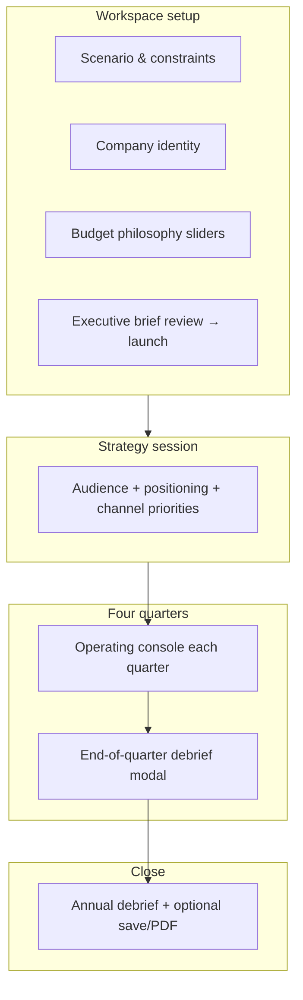

# CMO Simulator: User Flow, Stages, and Pedagogy

This document describes **what learners actually do** in each stage of the product, **which routes and controls map to those stages**, and **what each phase is trying to teach**. It complements the numeric engine reference in [`SIMULATION_ENGINE_REFERENCE.md`](./SIMULATION_ENGINE_REFERENCE.md).

---

## 1. How navigation ties to simulation state

The live simulation runs inside **`SimulationProvider`** (React context) backed by an **XState** machine (`simMachine.ts`). The machine phases align with URLs via **`resolveSimulationPath`** (`simulationRouting.ts`):

| Machine phase | Primary route | Typical meaning |
|---------------|----------------|-----------------|
| `idle` | `/sim/setup` | No active run initialized (or need setup) |
| `strategySession` | `/sim/strategy` | Strategic inputs required before Q1 |
| `Q1` … `Q4` | `/sim/q1` … `/sim/q4` | Quarterly operating console |
| `debrief`, `completed` | `/sim/debrief` | End-of-year review |

Visiting **`/sim`** redirects to the route that matches the **current phase** (loading spinner while resolving).

**Teaching intent:** Mirrors real operating rhythm—**context → strategy → quarterly execution → retrospective**—instead of dumping users straight into tactics.

---

## 2. High-level learner journey

Between quarters, learners can use **CRM-style** surfaces (**Campaigns**, **Pipeline**, **Analytics**) from the sim shell navigation—these **do not replace** completing a quarter on **`q1`–`q4`** pages; they support reflection on the same underlying **`SimulationContext`**.

---

## 3. Stage A — Workspace setup (`/sim/setup`)

Setup is a **four-step wizard** plus optional shortcuts and profile capture.

### 3.1 Global actions (always visible on setup)

| Action | What it does | Pedagogy |
|--------|----------------|----------|
| **Start Guided Demo Run** | Seeds a **Challenger**-style context with **prefilled** strategy fields and skips manual strategy typing for a faster tour | Low-friction **orientation** to quarterly mechanics |
| **Resume Latest Saved Run** | Appears when a saved run exists locally / from server; restores phase and jumps via **`resolveSimulationPath`** | **Continuity**—matches how real work is paused and resumed |
| **Profile Memory** block | Optional **full name**, **role/persona**, **marketing maturity**, **preferred difficulty**, **primary goals**; POSTed to **`/api/profile`** on successful launch | Frames the run as **personal professional practice**, not an anonymous quiz; data can personalize debrief hints |

### 3.2 Step 1 — Operating scenario

**User options**

- **Recommended default:** One-click **Challenger Brand** (lean budget, medium difficulty).
- **Advanced:** Choose among three scenarios (each fixes **industry**, **market landscape**, **time horizon**, **total annual budget**, **starting KPIs**, **board mandate copy**).

**Requirements to advance:** `scenarioId !== null`.

**Teaching intent**

- **Constraint-led thinking:** Budget and starting KPIs encode **turnaround vs hyper-growth vs challenger** tradeoffs before any tactic names appear.
- **Reading the board mandate:** Surfaces **executive narrative** (growth vs stabilization vs cult brand) that should inform later quarter choices.

### 3.3 Step 2 — Company identity

**User options**

- **Recommended company name** (“Northstar Systems”) or custom **official company name** (min 2 characters).
- **Advanced identity:** **Logo style** (orb / badge / monogram family via `LogoGenerator`) with live preview once the name is long enough.

**Requirements:** Trimmed company name length ≥ 2.

**Teaching intent**

- **Stakeholder realism:** Named workspace appears across **CRM shell** and debrief—builds ownership.
- **Brand system as constraint:** Identity choices preview how **brand-led** vs **neutral** positioning might feel in-market (supporting narrative; mechanical tie is primarily UX).

### 3.4 Step 3 — Budget philosophy

**User options**

- **Recommended split:** 35% Brand awareness / 40% Lead generation / 25% Conversion optimization.
- **Advanced:** Three sliders (**must sum to exactly 100%**) with guidance copy per pillar.

**Requirements:** `brandAwareness + leadGeneration + conversionOptimization === 100`.

**Teaching intent**

- **Planning bias vs line-item spend:** This step explicitly documents that sliders **do not spend dollars by themselves**; they set **posture** referenced when interpreting forecasts and tradeoffs later (`strategy.budgetAllocation` on context).
- **Portfolio vocabulary:** Forces articulation of **brand vs demand vs conversion** tension before tactics.

### 3.5 Step 4 — Executive workspace brief

**User options**

- Read-only style **review card**: scenario, mandate, industry, horizon, difficulty, annual budget, philosophy split, identity preview.
- Confirm and **launch** → persists **`cmo-sim-state-v2`**, optional **`saveSimulationSnapshot`**, navigates to **`/sim/strategy`**.

**Teaching intent**

- **Executive communication:** Summarizes decisions as if briefing a leadership team—good habit before committing capital.

---

## 4. Stage B — Strategy session (`/sim/strategy`)

**Guard:** Machine only allows leaving strategy when **`targetAudience`**, **`brandPositioning`**, and **`primaryChannels`** are all set (`COMPLETE_STRATEGY_SESSION` guard in `simMachine.ts`).

### 4.1 User inputs

| Input | Options | Stored on |
|-------|---------|-----------|
| **Target audience** | Preset segments (e.g. Young Professionals, SMB owners) or **custom** free text | `strategy.targetAudience` |
| **Brand positioning** | Presets (Premium, Value, Innovation, …) or **custom** | `strategy.brandPositioning` |
| **Primary channel priorities** | Multi-select: Digital, Social, Traditional, Content, Events, Partnerships | `strategy.primaryChannels` |

Mobile UX uses **three micro-steps** (audience → positioning → channels) with validation gates.

### 4.2 Completion actions

- **`startSimulation()`** then **`completeStrategySession()`** → transitions machine to **Q1** and routes to **`/sim/q1`**.

### 4.3 Teaching intent

- **Strategy before tactics:** Channels chosen here are **priorities**, not budgets yet; quarters translate **tactic categories** into engine channels (see engine reference).
- **Audience–positioning fit:** Encourages coherent **who + why us** before spend.
- **Explicit channel mix:** Later, learners can compare **what they said matters** vs **what they actually funded** each quarter (Campaigns / Analytics).

---

## 5. Stage C — Quarterly operating (`/sim/q1` … `/sim/q4`)

Each quarter page wraps **`QuarterOperatingConsole`** with quarter-specific **subtitle**, **available tactic slice** from `SAMPLE_TACTICS`, and optional **`specialActions`**.

### 5.1 Rules common to every quarter

| Rule | Detail |
|------|--------|
| **Quarter budget** | `floor(totalAnnualBudget / 4)` |
| **Completing the quarter** | At least **one** tactic selected **and** sum of tactic costs **≤** quarter budget |
| **Finalize button** | Opens **`EndOfQuarterDebrief`** modal—not yet advancing machine until user confirms |
| **On confirm** | `completeQuarter(quarter)` runs **`processQuarterAdvance`** (engine tick + KPI merge), saves snapshot, telemetry, routes to next quarter (Q4 → debrief route after modal text) |

**Teaching intent**

- **Cadence & envelope:** Marketing operates in **time-boxed** commitments with a hard **quarter ceiling**—prevents “infinite pilot.”
- **Minimum viable plan:** Requires ≥1 tactic—no empty quarter without acknowledging consequences.

### 5.2 Console surfaces (all quarters)

Learners can:

| Capability | Purpose |
|------------|---------|
| **Browse available tactics** | Each card shows cost, category, narrative; some enriched tactics expose **business role / tradeoffs** via `getTacticBusinessProfile` |
| **Add / remove tactics** | Mutually exclusive per tactic id for that quarter; adjusts **`remainingBudget`** globally |
| **Forecast panels** | **`buildSimulationForecast`** recomputes projected KPI deltas and downside/base/upside scenarios **from current draft selection** |
| **Executive pressure strip** | **`ExecutivePressure`**: quarter-aware narrative warnings from **KPI levels** and **time horizon** (e.g. revenue pace in H1, share risk before Q4)—not a substitute for board votes but teaches **stakeholder pacing** |
| **CMO Mentor / tooltips** | Contextual coaching strings tied to metrics and tactics |

**Teaching intent**

- **Forecast-first discipline:** Same resolver as resolution encourages **hypothesis → projected outcome → commit**.
- **Narrative pressure:** Connects numbers to **board anxiety windows** through the year.

### 5.3 Quarter-specific options

#### Q1 (`/sim/q1`)

- **Special quarter actions:** None beyond core console.
- **Tactic pool:** First slice of `SAMPLE_TACTICS` (indices **0–5** in code).
- **Teaching intent:** **Foundation quarter**—establish measurable signal without assuming crisis playbooks yet.

#### Q2 (`/sim/q2`)

- **Quarter options:**
  - **Review talent options** → **`TalentMarketModal`** (random candidate pool; **once per quarter** trigger guard). Lets learner explore hiring narratives against **remaining quarter budget** context.
  - **Open market briefing** → optional wildcard (`WildcardModal`) via **`getEnhancedWildcardForQuarter`**.
- **Auto wildcard:** On mount, **random chance** may auto-open a wildcard (~30% when modal idle—implementation detail).
- **Tactic pool:** `SAMPLE_TACTICS.slice(4, 10)`.
- **Mobile:** Optional sheet prompts learner to use talent/wildcard vs continue planning.
- **Teaching intent:** **Operating reality**—scaling introduces **people decisions** and **external shocks** while defending Q1 choices.

#### Q3 (`/sim/q3`)

- **Quarter options:**
  - **Review market risk** → manual wildcard trigger.
  - **Evaluate strategic bet** → **`BigBetModal`** with **three random big bets**; **one selection per run** (`bigBetMade`). Resolves **`calculateBigBetOutcome`** (risk-weighted random success). Deducts bet cost and applies KPI deltas immediately via **`MAKE_BIG_BET`**.
- **Auto wildcard:** Higher random chance than Q2 when idle (~20%).
- **Tactic pool:** `SAMPLE_TACTICS.slice(8, 14)`.
- **Teaching intent:** **Asymmetric bets**—mid-year is where leadership often **concentrates or hedges**; randomness teaches **risk governance** (size of bet vs runway).

#### Q4 (`/sim/q4`)

- **Quarter options:** **Run final risk check** (wildcard).
- **Auto wildcard:** Random chance when idle (~40%).
- **Tactic pool:** `SAMPLE_TACTICS.slice(12, 18)`.
- **Complete label:** Framed as **annual** closure.
- **Teaching intent:** **Defense & storytelling**—year-end is when boards ask for **scorecard + narrative** under residual volatility.

### 5.4 Wildcard interactions (Q2–Q4)

**Typical flow**

1. Event surfaces in **`WildcardModal`** with type styling (crisis, opportunity, market shift, competitor).
2. Learner picks a **choice** (each may list **cost**, **time**, **impact preview**).
3. **`respondToWildcard`** records selection and deducts choice cost from **`remainingBudget`** when applicable.
4. Hook sends **`APPLY_WILDCARD_IMPACT`** so **`impact`** merges into quarter rollup and may adjust **morale** / **brandEquity**.

**Teaching intent**

- **Branching consequences:** Marketing leads must often **trade cash + reputation + speed**.
- **Risk communication:** Copy + impacts reinforce **second-order effects** (trust, satisfaction).

---

## 6. Between-quarter “CRM” surfaces (optional reflection)

These routes read the same **`SimulationContext`**:

| Route | Role |
|-------|------|
| **`/sim/campaigns`** | Tabular **campaign/tactic ledger** by quarter and category |
| **`/sim/pipeline`** | Funnel-style view with engine stress / flow hints |
| **`/sim/analytics`** | Charts of quarterly revenue/profit/share |

**Teaching intent:** Connect **planning UI** to **post-hoc analysis**—similar to CRM / BI hygiene in real orgs.

Other hub links:

- **`/sim/simulations`** — saved run history (when persistence enabled).
- **`/sim/credits`**, **`/sim/pipeline`**, etc. — supplementary UX shell destinations.

---

## 7. End-of-quarter debrief (modal)

**Component:** `EndOfQuarterDebrief`.

**Shown:** Immediately after user clicks **Finalize Q# plan** and before routing.

**Content driven by:** **`buildSimulationForecast`** for that quarter and tactic list—shows projected metric grid, **positive vs negative deltas**, **risk bullets**, and scenario framing.

**Teaching intent**

- **Pause–reflect loop:** Forces interpretation **before** state advances—like a quarterly business review **dry run**.
- **Connect selections to KPI movement:** Uses same projection stack as console forecast for consistency.

---

## 8. End-of-year debrief (`/sim/debrief`)

When Q4 completes, navigation flows to **`/sim/debrief`**. On mount the page calls **`completeDebrief()`** (machine transitions toward **`completed`**) and may show **celebratory UI** (`ConfettiEffect`).

### 8.1 Primary UI: `EnhancedDebrief`

Slideshow-style experience combining:

| Element | Source / behavior | Teaching intent |
|---------|-------------------|----------------|
| **Quarterly revenue / share charts** | Reads **`context.quarters`** results | **Temporal narrative**—where momentum broke |
| **Grade archetype labels** | Slide-specific heuristic grading band | **Gamified reflection** (note: headline grade math may differ from PDF score—see §8.3) |
| **Teaching report strings** | **`buildTeachingReport`** (`simulationInsights.ts`): outcome, why, tradeoff, nextMove, growthLeaderTakeaway | **Structured retrospective** |
| **Score breakdowns** | **`buildSimulationScoreBreakdowns`** (`simulationIntelligence.ts`): setup / strategy / each quarter | Rewards **process completeness** (strategy filled, tactics depth, profitability signals), not only terminal KPIs |
| **Recommendations** | **`deriveSimulationRecommendations`** | Prioritized improvement backlog |

Actions exposed:

- **Save run** — requires auth session (`saveSimulationSnapshot`, debrief phase **`completed`**).
- **Export PDF** — builds **`SimulationDebriefReport`** then renders **`SimulationDebriefPdf`**.
- **Restart** — resets machine and routes to **`/sim/strategy`** for a fresh strategic pass.

### 8.2 PDF export contents (`SimulationDebriefPdf`)

Built by **`buildSimulationDebriefReport`** (`simulationReport.ts`). Sections:

| Section | Contents | Why it matters |
|---------|-----------|----------------|
| Header | Title, ISO timestamp, optional user email/name | Audit trail |
| Stat grid | **Strategic score**, **grade**, cumulative **revenue**, **profit**, **market share**, **customer satisfaction** | Single-page **executive snapshot** |
| Executive summary | **Outcome**, **Why**, **Tradeoff**, **Recommended next move** | Narrative memory (“what did we learn?”) |
| Quarterly table | Per-quarter **revenue**, **profit**, **share**, tactic names | **Accountability trail** |
| Top decisions | Up to **five** highest-cost tactics across year | Highlights **capital concentration** |
| Biggest risk | **`deriveTopRisk`** heuristic (unused budget, weak satisfaction/share, category concentration, …) | Surfaces **dominant failure mode** |

Score + grade in PDF use **`calculateOverallScore`** / **`calculateGrade`** from **`simulationInsights.ts`** (function of **sum of quarterly revenues** and **Q4 market share**).

### 8.3 Scoring nuance (transparency)

The codebase uses **multiple complementary scores**:

- **`simMachine.calculateFinalResults`** embeds a KPI blend used when **`CALCULATE_RESULTS`** style flows reference **`SimulationResults`**.
- **`simulationInsights.calculateOverallScore`** drives **PDF / debrief intelligence** slices above.
- **`EnhancedDebrief`** slide hero score uses its **own combined formula** for presentation tiers.

**Teaching intent for learners:** Treat scores as **different lenses**—financial outcome vs process completeness vs UI storytelling—and focus debrief discussion on **drivers**, not a single number.

---

## 9. Pedagogy summary table

| Stage | Primary skill practiced |
|-------|-------------------------|
| Setup scenario | Interpreting **constraints** and **mandates** |
| Identity | **Stakeholder ownership** and brand framing |
| Budget philosophy | **Portfolio posture** (brand vs demand vs conversion) |
| Strategy session | **ICP + positioning + channel thesis** |
| Q1 | Building a **defensible baseline mix** |
| Q2 | **Scaling** under **talent + volatility** |
| Q3 | **Risk-taking / bets** and mid-course correction |
| Q4 | **Closing narrative** and resilience |
| Wildcards | **Tradeoffs under uncertainty** |
| Forecast / debrief | **Measurement literacy** and retrospective discipline |

---

## 10. Related docs

- [`SIMULATION_ENGINE_REFERENCE.md`](./SIMULATION_ENGINE_REFERENCE.md) — formulas and variables behind outcomes.
- [`SIMULATION_DESIGN_SPEC.md`](./design/SIMULATION_DESIGN_SPEC.md) — broader product vision (may exceed shipped scope).
- [`README.md`](../README.md) — setup and repo orientation.

---

*Aligned to App Router pages under `src/app/sim/` and components under `src/components/simulation/` at authoring time; verify after major UX refactors.*
